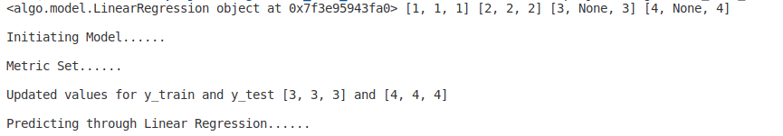

Inheritance is setup from Model--> Regression-->Linear Regression 

If Model is passed any list with NULL values,@nulls_with_average decorator would replace the NULL with average of the rest of the values.

